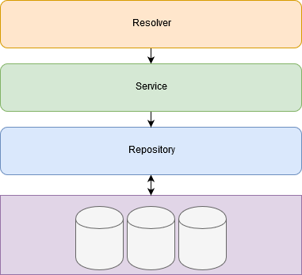

# GraphQL Example Application
This repository gives an overview of how you could structure a GraphQL-Application written in Go. It uses gqlgen to generate necessary GraphQL server files. A complete list of used Tools and Frameworks can be found later in this README.

## Contents
1. [Intentions](#intentions)
2. [Getting Started](#getting-started)
    * [Noteworthy things that should be considered while developing](#noteworthy-things-that-should-be-considered-while-developing)
3. [Frameworks and Tools](#frameworks-and-tools)
4. [Core Concepts](#core-concepts)
    * [Repository](#repository)
    * [Service](#service)
    * [Resolver](#resolver)

## Intentions
* Providing an example project that can be used as boilerplate for starting up a project
* Demonstrating the used core-concepts for well-structuring a Go application (Something i've struggled with a long time) 
* Learning from mutual feedback and improve this approach

## Getting started
* Clone or download this project

* Generate the GraphQL-Server and Resolver-Interfaces by running `go run github.com/99designs/gqlgen generate` in your project directory

* Starting up the server by running `go run cmd/main.go`

* Visit `localhost:1337/playground` for getting started with the API

### Noteworthy things that should be considered while developing
**Schema-Changes lead you to re-generate**
* very change in the `schema.graphql` should be finished with re-generating the GraphQL-Files by running `go run github.com/99designs/gqlgen generate`.

**New Actions are not automatically added to the resolvers-implementation**
* New Actions inside the schema do not lead gqlgen to add them to your resolvers. You are responsible for implement them on your own (The interface containing all necessary functions can be found in `graphql/server_generated.go`).

**Models should live only inside your `model`-directory**
* When you define a new model inside `schema.graphl` and re-generate your files, the schema will be generated and added to `graphql/models_generated.go`.
* However, you should copy it to your own `model`-directory and mention this inside `gqlgen.yml`.
* This will keep your repository clean and never would end up in losing additions when you re-generate your GraphQL-Server.

## Frameworks and Tools
|Framework/Tool|Description|
|---|---|
|[99design/gqlgen](https://github.com/99designs/gqlgen)|Generating GraphQL-Server and Resolver-Interface based on `schema.graphql`. Can also generate missing models|
|[sirupsen/logrus](https://github.com/sirupsen/logrus)|Structured logging library including a native JSON-formatter. Making logging a lot more comfortable|
|[gofrs/uuid](https://github.com/gofrs/uuid)|Used for generation UUIDs for the in-memory database used in this example|
|[muesli/cache2go](https://github.com/muesli/cache2go)|Embedded Key-Value Database. Used as Storage-Backend for this example|
|[prometheus/client_golang](https://github.com/prometheus/client_golang)|Prometheus client is used for providing `/metrics` endpoint|
|[dimiro1/health](https://github.com/dimiro1/health)|Tool for providing a simple `/status` endpoint. Used for health-checking|

## Core Concepts

    

### Repository
The Repository layer is holding logic for interactions with any kind of data store.
This could be a database or streaming-service.
A repository is always defined through an interface before implementing it.
This is important to keep it testable.
They live inside the `repository`-directory.

* **Logging:** Should not provide logic-based, but technical logging (e.g. connection-failures, timeouts). A not found database-row is mostly not a technical error, even if your db-driver returns an error in this case.

* **Errors:** Errors returned by this Layer are not concerned for being seen by the end-user. Errors could contain sensible informations.

### Service
Your business-logic lives in the Service layer.
Every action a user can do should be implemented in a service layer, but is not to this.
A service could also provide functions used by other services, e.g. retrieving configuration.
Similar to repositories, services should always be described through an interface.
So you could mock it during tests.
They live inside the `service`-directory.

* **Logging**: Responsible for logic-based logging. Should log faulty actions (retrieving not existing entities, try accessing data without permission)

* **Errors**: Errors should be non-technical and suited for the end-user. Not to much technical details, no sensible informations.

### Resolver
Resolvers are GraphQL construct for handling requests.
They are described in the `schema.graphql` file.
An interface for each type of action (Query, Mutation, Subscription) is created through gqlgen.
This interface holds all possible user-actions and needs to be implemented.
In this example, the implementation is done in the `graphql/resolvers.go` file.
For larger projects it might be a good idea to use multiple files instead.

* **Logging**: Logs everything interesting happening in data-transmission. In this example gqlgen should perform this aspect of logging.

* **Errors**: Errors from the Service should be passed through from the Service layer.